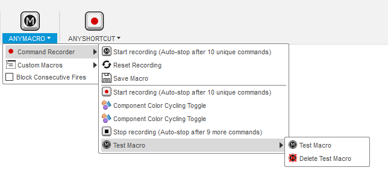

#  AnyMacro

AnyMacro is an Autodesk® Fusion 360™ add-in for assigning macros from last run commands. It also has some built-in macros for Fusion 360™ commands that cannot easily be capture and run without some extra tweaking (e.g. *Look At Sketch*).

If you get any problems, please check out the section on [Fusion 360 quirks](#fusion-360-quirks).

## Built-in Macros

The built-in commands are always visible in the *AnyShortcut* menu. Assign shortcuts to them in the usual way.

Built-in commands include:

 * Align Camera

## Recording

When enabled, the add-in records the resulting commands of actions that the user performs and collects them in the *AnyShortcut* menu. The commands in the menu can then be assigned shortcut keys in the regular way.

If not stopped, the recording stops automatically after a number of commands, to avoid any performance degradation when the user is not setting up shortcuts.

\* Not all actions in Fusion 360™ result in "Commands" and some commands are not usable on their own. For example, *Pick Circle/Arc Tangent* does not generate a "Command" and *Roll History Marker Here* is triggered when clicking rewind in the history, but rewind actually first selects an item and then rolls.

### Usage

To set up a macro:

* Click *Start recording* and then launch a series of commands in the order you desire for your macro.
* If the commands you chose are able to be recorded, they will be added underneath the record command in the *Command Recorder* dropdown at the top of the *AnyMacro* panel.
* Should you desire to remove a command, you need just click its name within the dropdown.
* Once you stop recording, two new options: *Save Macro* and *Reset Recording*; should appear just under the record command along with a test macro at the bottom of the list. The test macro allows you to make sure everything works before you save it and see the changes you make to the command list.
* Finally, once you are satisfied with the macro, hit the *Save Macro* button. This will display a prompt that will ask you to name your macro. There are few restrictions on the name, however, make sure there are *some* numbers or letters as its ID will be created using the `str.isidentifier()` method for each character.
* You should now find your command under the *Custom Macros* dropdown. You can assign it to keys, run, and delete it right from the command. Additionaly, the macro is persistant, meaning it will remain between sessions of fusion360 and only needs to be created once.

To remove a macro, navigate to its location under the *Custom Macros* dropdown and select the remove option under it. A prompt will appear asking if you are sure you wish to remove it.

## Fusion 360 Quirks

Be aware of the following quirks in Fusion 360™.

* Even though you've added a shortcut, it might not show up next time you restart Fusion 360™. However, the shortcut still works and you see it if you open *Change Keyboard Shortcut*. (You can also verify using [KeyboardShortcutsSimple](https://github.com/thomasa88/KeyboardShortcutsSimple/blob/master/README.md))

* Fusion 360™ cannot handle all key combinations. Forget Alt+Left to rollback history, because Fusion 360™ cannot save this combination and it will be broken next time you start Fusion 360™.

* Menu items in sub-menus are not always clickable ([bug](https://forums.autodesk.com/t5/fusion-360-api-and-scripts/api-bug-cannot-click-menu-items-in-nested-dropdown/td-p/9669144)). However, you don't need to be able to click the commands to map a shortcut!

## Supported Platforms

  * Windows
  * Mac OS

## Installation

Download the add-in from the [Releases](https://github.com/thomasa88/AnyShortcut/releases) page.

Unpack it into `API\AddIns` (see [How to install an add-in or script in Fusion 360](https://knowledge.autodesk.com/support/fusion-360/troubleshooting/caas/sfdcarticles/sfdcarticles/How-to-install-an-ADD-IN-and-Script-in-Fusion-360.html)).

Make sure the directory is named `AnyShortcut`, with no suffix.

The new menu *TOOLS* -> *ANYSHORTCUT* is now available.

The add-in can be temporarily disabled using the *Scripts and Add-ins* dialog. Press *Shift+S* in Fusion 360™ and go to the *Add-Ins* tab.

## Ideas for commands to map

Here is a table of some commands that can be interesting to map.

| Command                     | Notes                                                        |
| --------------------------- | ------------------------------------------------------------ |
| Rename, in the timeline     | Let's you select an item in the timeline and press F2 to rename it. I have not found any way to do this in the browser. |
| Look at (bottom toolbar)    | Select a face and orient the view normal to it. I have not found any way to tell it to "Look at" the current. |
| Isolate                     |                                                              |
| Find in Browser             |                                                              |
| Find in Window              |                                                              |
| Activate Component          | Works in the Browser and in the 3D space, but you must have selected a component in 3D space, not a body or a face. |
| Remove                      | Opposed to *Delete,* *Remove* appears as a timeline feature. |
| Simulate or other workspace | Easily switch to a workspace.                                |

## Finding out what keys you have mapped

See [KeyboardShortcutsSimple](https://github.com/thomasa88/KeyboardShortcutsSimple/blob/master/README.md).

## Reporting Issues

Please report any issues that you find in the add-in on the [Issues](https://github.com/thomasa88/AnyShortcut/issues) page.

For better support, please include the steps you performed and the result. Also include copies of any error messages.

## Author

This add-in is created by ZXYNINE and is based off of Thomas Axelsson's AnyShortcut.

## License

This project is licensed under the terms of the MIT license. See [LICENSE](LICENSE).

## More Fusion 360™ Add-ins

[My Fusion 360™ app store page](https://apps.autodesk.com/en/Publisher/PublisherHomepage?ID=JLH9M8296BET)

[All my add-ins on Github](https://github.com/topics/fusion-360?q=user%3Athomasa88)

## Changelog

* v 0.1.0
  * Original Implementation 

